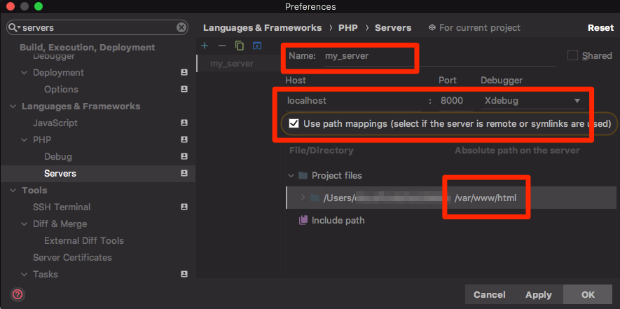
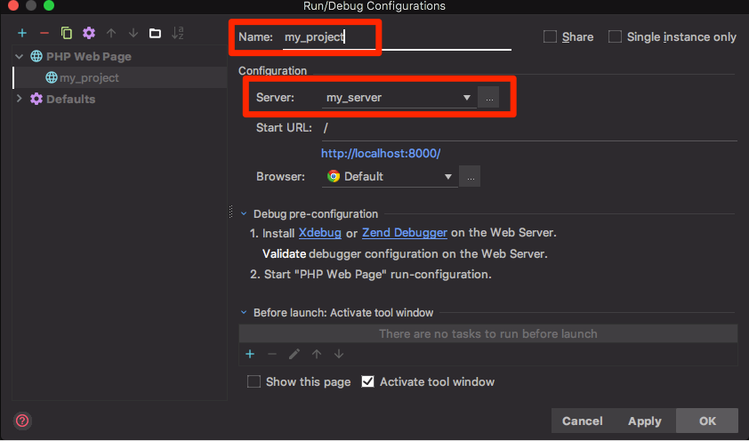

# Docker Ubuntu / Apache / PHP

Docker container with installed and configured Ubuntu, Apache, PHP7 and XDebug.

## About

#### Installed Software:

- `Ubuntu 16.04`
- `Apache 2`
- `PHP 7.1`
- `Xdebug v2.5.5`

# Table of Contents

* [Volumes and Environment Variables](#volumes-and-environment-variables)
* [Build Image](#build-image)
* [Run Container](#run-container)
* [Docker-Compose Section](#docker-compose-section)
* [Example Configuration with MySQL and Adminer](#example-configuration-with-mysql-and-adminer)
* [Setup PHPStorm for XDebug with Docker](#setup-phpstorm-for-xdebug-with-docker)


## Volumes and Environment Variables

#### Volumes

* `/var/www/html`
* `/var/log/apache2`

#### Environment Variables

The environment variables can be changed with the `-e` parameter 

* `XDEBUG_REMOTE_HOST` - When using Mac or Windows as host, this variable is set automatically
* `XDEBUG_REMOTE_PORT` - Default 9000
* `DOCUMENT_ROOT` - Where your index.php is located. Default `/` (`/public` with most frameworks)
* `DATE_TIMEZONE` - Sets the corresponding php.ini value
* `LOG_TO_FILE` - If set to 1, log is written to /var/log/apache2 (= volume)

## Build Image

    git clone https://github.com/clausnz/docker_ubuntu-apache-php.git
    cd docker_ubuntu-apache-php
    docker build -t <tag_name> .

## Run Container

##### Run image with following command:

    docker run \
        -d \
        --restart=always \
        --name my_ubuntu-apache-php \
        -p 8000:80 \
        -p 4430:443 \
        -v $(pwd):/var/www/html/ \
        -v $(pwd)/apache_logs:/var/log/apache2/ \
        -e DOCUMENT_ROOT=/ \
        clausnz/ubuntu-apache-php:latest

## Docker-Compose Section

Edit `docker-compose.yml`

```
version: "3"

services:
    web:
        image: "clausnz/ubuntu-apache-php:latest"
        restart: "always"
        ports:
            - "8000:80"
            - "4430:443"
        volumes:
            - .:/var/www/html
            - ./apache_logs:/var/log/apache2
        environment:
            - DOCUMENT_ROOT=/       
```

## Example Configuration with MySQL and Adminer

* Copy following content and save as file `docker-compose.yml`
* Run `mkdir -p mysql_datadir mysql_dumpdir apache_logs` to create folders
* Create `index.php` file with command `echo -e "<?php\nphpinfo();" > index.php`
* Optional: Move any sql-files to `mysql_dumpdir` to run against database on startup 
* Run command `docker-compose up -d`
* Open browser at `http://localhost:8000` (Apache) and `http://localhost:8080` (Adminer) 
* Make sure to accept the certificate warning when opening `https://localhost:4430` (Apache SSL)

```
version: "3"

# create following directories in project root:
# mkdir -p mysql_datadir mysql_dumpdir apache_logs

# set DOCUMENT_ROOT according to your project, where the index.php file is located (e.g. /public with most frameworks)

services:
    web:
        image: "clausnz/ubuntu-apache-php:latest"
        restart: "always"
        ports:
            - "8000:80"
            - "4430:443"
        volumes:
            - .:/var/www/html
            - ./apache_logs:/var/log/apache2
        environment:
            - DOCUMENT_ROOT=/
            - DATE_TIMEZONE=Pacific/Auckland
    db:
        image: mysql
        restart: always
        volumes:
            - ./mysql_datadir:/var/lib/mysql
            - ./mysql_dumpdir:/docker-entrypoint-initdb.d
        ports:
            - "3306:3306"
        environment:
            MYSQL_ROOT_PASSWORD: example
            MYSQL_DATABASE: example
            MYSQL_USER: example
            MYSQL_PASSWORD: example

    adminer:
        image: adminer
        restart: always
        ports:
            - 8080:8080
        environment:
          - ADMINER_DESIGN=lucas-sandery
```
        
## Setup PHPStorm for XDebug with Docker

As the image is preconfigured with XDebug for Docker debugging, you only have to set up your IDE. Here is an example for PHPStorm:

#### Setup XDebug in PHPStorm > Settings > Languages & Frameworks > PHP > Debug


#### Setup Server in PHPStorm > Settings > Languages & Frameworks > PHP > Servers


#### Setup Run/Debug Configuration


#### Set your breakpoints and you're done.