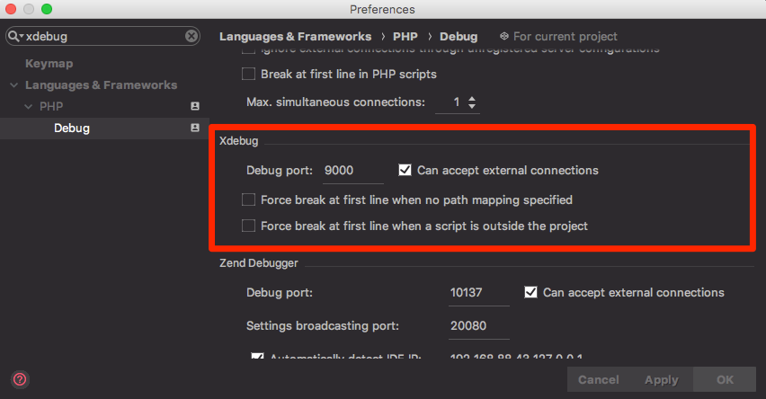

# Docker Ubuntu / Apache / PHP

Docker container with installed Ubuntu, Apache and PHP7.

## About

#### Installed Software:

- Ubuntu 16.04
- Apache 2
- PHP 7.1

#### Shared volume:

- /var/www/html

# Table of Contents

[Debug Example with PHPStorm](#setup-phpstorm-for-debugging)

#### Build image:

    git clone https://github.com/clausnz/docker_ubuntu-apache-php.git
    cd docker_ubuntu-apache-php
    docker build -t <tag_name> .

#### Example:

##### Run image with following command:

    docker run \
        -d \
        --restart=always \
        --name my_ubuntu-apache-php \
        -p 8000:80 \
        -v $(pwd):/var/www/html/ \
        clausnz/ubuntu-apache-php:latest

##### Docker `docker-compose.yml` section:

    version: "3"
    services:
    web:
        image: "clausnz/ubuntu-apache-php:latest"
        restart: "always"
        ports:
        - "8000:80"
        volumes:
        - .:/var/www/html
        
## Setup PHPStorm for debugging

As the image is preconfigured with XDebug, you only have to set up your IDE. Here is an example for PHPStorm:

#### Setup XDebug in PHPStorm > Settings > Languages & Frameworks > PHP > Debug

#### Setup Server in PHPStorm > Settings > Languages & Frameworks > PHP > Servers

#### Setup Run/Debug Configuration

#### Set your breakpoints and you're done.